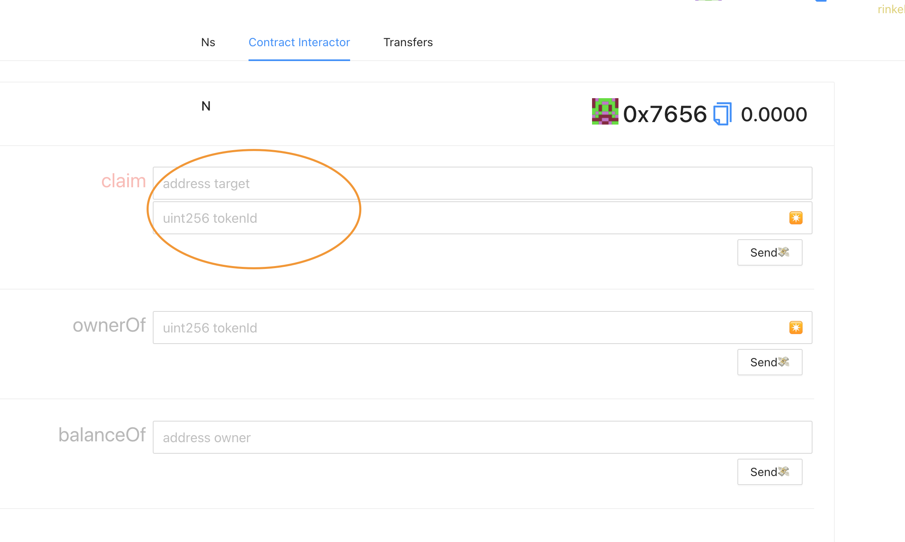

# Dapp-Learning-MOH
我们鼓励开发者对 Dapp-Learning 项目提供更多的代码贡献, 同时对于已经贡献 PR 及后续贡献 PR 的开发者, 作为奖励 Dapp-Learning 项目组发放荣誉勋章 NFT 给 PR 贡献者.   
Dapp-Learning-MOH 项目旨在提供发放 Dapp-Learning 的荣誉勋章的功能模版, 社区开发者可以根据此模版进行修改升级, 以实现符合自身业务的功能需求. 

## 操作步骤  

- 修改部署网络  
1. 默认合约是部署在测试网络, 如果需要部署在其他网络, 需要修改合约部署脚本.  
如下, 在 hardhat.config.js 文件中有如下配置, 修改 "defaultNetwork" 的网络值就可以指定合约所要部署的网络. 当前默认配置网络为 Polygon 测试网
```
const defaultNetwork = "matic_mumbai";
```

2. 前端启动时, 也会检查 metamask 钱包所选择的网路是否和合约部署网络对应.如果修改了默认的合约部署网路, 对应在 react-app/src/App.jsx 文件中, 也需要进行相应的修改, 具体需要修改的代码如下.  
```
const targetNetwork = NETWORKS.matic_mumbai;
```

3. 同时在 react-app/.env 文件中配置了 REACT_APP_PROVIDER , 如果修改默认网络, 这里的配置也需要进行修改 
```
REACT_APP_PROVIDER=https://polygon-mumbai.infura.io/v3/<YOUR INFURA PROVIDER ID>
```

- 申请测试币  
如果没有修改默认配置, 那么需要到 [polygon 测试网](https://faucet.polygon.technology/) 上去申请测试币  

- 配置私钥和 INFURA_ID  
在部署合约之前, 需要进行如下配置下
```shell
## 进入 hardhat 目录
cd hardhat

## 复制 .env.example 文件为 .env
cp .env.example .env

## 在 .env 文件中配置 INFURA_ID 和 PRIVATE_KEY
## 其中 PRIVATE_KEY 可以从 metaMask 中获取, 同时需要保证私钥对应账户有充足的 ETH 
## INFURA_ID 需要登陆 INFURA 账号进行获取

PRIVATE_KEY=xxxxxxxxxxxxxxxx  
INFURA_ID=yyyyyyyy
```  

- 安装依赖   
```shell
## 进入到项目根目录
cd Dapp-Learning-MOH

## 执行 yarn 安装相应的依赖  
yarn
```

- 合约部署  
执行如下命令, 进行合约部署  
```shell
yarn deploy
```

- 替换合约地址   
MOH 合约为可升级合约, 所以我们不能直接和 MOH 合约进行交互, 需要和代理合约进行交互. 这里, 修改 MOH 合约地址为代理合约地址  
```shell
yarn replace
```

- 配置 react 环境变量  
```shell
cd react-app
cp .sample.env .env

## 修改 .env 中的 REACT_APP_PROVIDER 配置
REACT_APP_PROVIDER=https://polygon-mumbai.infura.io/v3/<YOUR INFURA PROVIDER ID>
```


然后执行如下命令启动前端  
```shell
## 进入到项目根目录
cd Dapp-Learning-MOH

## 启动前端
yarn start
```

- Mint NFT  
前端界面上选择 "Contract Interactor", 然后在 claim 中输入 target address 和 NFT id , 之后点击 "Send", 之后在 "Ns" 标签页就可以看到当前所拥有的 NFT.  
需要注意的是, 应为合约配置了 Mint 权限校验, 当前 MetaMask 连接的账户需要对应为在步骤 "配置私钥和 INFURA_ID" 中配置的私钥对应的账户, 否则无法发送交易. 
  

- Display NFT  
前端界面上选择 "Ns", 就可以看到当前属于这个账户的 Loot NFT.  
  